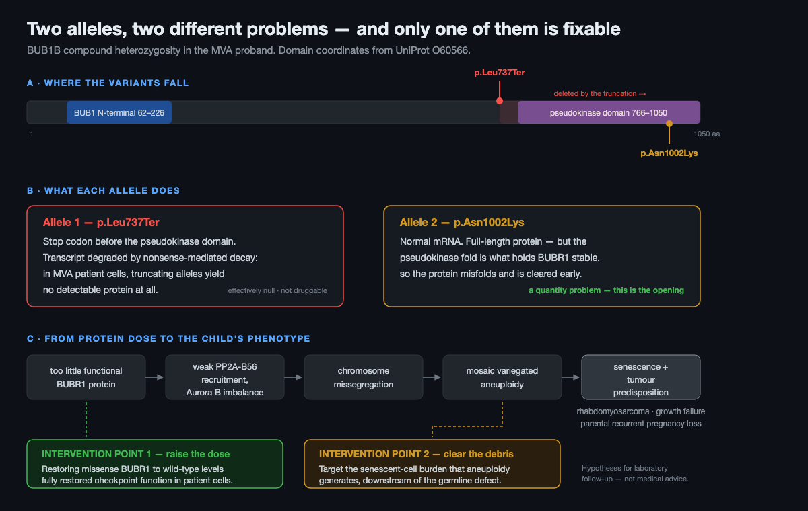

# Track 2 Report — Drug Repurposing in Mosaic Variegated Aneuploidy

**Rare Disease, Real Kid: The MVA Hackathon 2026 · Track 2 · Team Samistus1234**
Code: https://github.com/Samistus1234/mva-hackathon

> **What this document is.** A mechanism-led assessment of repurposing candidates for one
> child with MVA1, and an honest account of which candidates survive scrutiny. These are
> research hypotheses for laboratory follow-up. Nothing here is medical advice, no drug
> named here is established therapy for MVA, and no recommendation here should reach a
> patient without the preclinical work described in §7.

---

## 1. Executive summary

Track 1 established the genotype: compound-heterozygous *BUB1B*, **p.Leu737Ter** with
**p.Asn1002Lys**, scored as a full match against the clinically confirmed answer
(100 rank points, F-max 1.000). Track 2 asks what, if anything, could be done about it.

The honest answer has three parts.

**First, the two alleles are not equivalent, and that asymmetry is the entire
therapeutic opening.** The truncating allele produces no protein at all. The missense
allele produces a full-length protein that is *made normally and then destroyed early*.
In MVA patients carrying exactly this architecture, restoring such missense protein to
wild-type levels **fully restored mitotic checkpoint function** — the defect in that
allele class is quantity, not quality (Suijkerbuijk 2010, PMID 20516114). A therapy that
raises residual BUBR1 therefore has a defined, published mechanism of benefit.

**Second, no repurposed drug survives this patient's specifics.** We assessed all three
axes the biology points to, and reported what we found rather than what we hoped:

| Axis | Mechanism | Why it does not proceed here |
|---|---|---|
| **NAD⁺ / SIRT2** (NMN, nicotinamide riboside) | raises BubR1 via K668 deacetylation | tumours are NAD⁺-avid — oncology builds drugs to *deplete* it. Untested on any missense allele, and the headline mouse result is routinely misattributed (§5.2). |
| **Senolytics** (dasatinib + quercetin, fisetin) | clears the senescent burden aneuploidy creates | dasatinib's labelled paediatric harm is **growth retardation** — this child's presenting complaint. Senescence is tumour-suppressive in rhabdomyosarcoma. No child has received a senolytic in any trial (§5.3). |
| **Proteostasis** (arimoclomol) | the most mechanistically proximate lever: the mutant is cleared as misfolded | boosting proteostasis is the antidote to the known aneuploidy-selective vulnerabilities, so it may protect pre-malignant cells; the agent's generic mechanism failed in the two diseases where it was tested (§5.4). |

**Third — and this is the contribution we would defend hardest — the rate-limiting step is
not drug choice, it is measurement.** Nobody has assayed BUBR1 protein level or half-life
for p.Asn1002Lys; nobody has quantified senescent-cell burden in MVA patient tissue; and
there has never been a registered clinical trial for MVA or *BUB1B* — `totalCount 0` for
both queries. We therefore propose a **measurement-first programme** (§7): two inexpensive
experiments on patient-derived cells, each designed to *refute* one of our own hypotheses,
that decide which axis if any deserves a drug at all.

**Where that leads.** No one has ever attempted to pharmacologically stabilise BUBR1 — a
real white space. And it is now a tractable one: raising a destabilised missense protein is
a proven modality (migalastat in Fabry; elexacaftor/tezacaftor/ivacaftor in CF), and
deucravacitinib is an approved drug that works by binding a **pseudokinase** domain and
locking its conformation — which is structurally the same problem BUBR1 presents. The
recommendation we would put to a funder is not a repurposed prescription today, but a
purpose-built BUBR1 stabiliser programme with the §7 assays as its entry criterion (§5.5).

Alongside the analysis we release **`repurpose.py`**, a mechanism-hop tool built for the
general case: when a rare-disease gene has no drugs (BUB1B has *zero* in DGIdb), it hops
through the gene's interaction neighbourhood to find druggable partners. Run blind on
BUB1B it independently converges on the BUBR1 acetylation machinery — the exact axis the
literature points to — which is how that axis earned its place here rather than being
assumed into it.

---

## 2. The patient, in the terms the challenge provides

The proband is a child whose clinical picture (HPO terms as released with the challenge)
comprises rhabdomyosarcoma (HP:0002859), nephrocalcinosis since birth (HP:0000121),
short stature (HP:0004322), failure to thrive (HP:0001508) with skeletal muscle atrophy
(HP:0003202), premature birth at 32 weeks (HP:0001622), small-for-gestational-age birth
weight around 1 kg (HP:0001518), and a parental history of recurrent spontaneous abortion
(HP:0200067).

Read together this is a chromosome-segregation disorder: cancer predisposition plus
severe pre- and post-natal growth restriction plus parental reproductive loss is the
signature of constitutional aneuploidy, and the parents' miscarriages are part of the
phenotype rather than background — embryonic aneuploidy arising from the same defect.

*Per the challenge's data-use terms, this report adds no clinical detail beyond the
released phenotype document, and the repository contains no patient data.*

---

## 3. Mechanism: two alleles, two different problems



### 3.1 Where the variants fall

BUBR1 (UniProt O60566) is 1050 residues, with a BUB1 N-terminal domain at 62–226 and a
C-terminal **pseudokinase** domain at 766–1050.

| Allele | Position | Consequence |
|---|---|---|
| p.Leu737Ter | 737 / 1050 | stops translation *before* the C-terminal domain; nonsense-mediated decay |
| p.Asn1002Lys | 1002 / 1050 | full-length protein carrying a substitution *inside* the C-terminal domain |

### 3.2 A correction that changes the therapeutic logic

It is tempting to describe a variant at position 1002 as impairing kinase activity. That
would be wrong, and the error matters.

Human BUBR1 is a **pseudokinase**. Suijkerbuijk et al. showed that "putative catalysis by
human BUBR1 is dispensable for error-free chromosome segregation," and — decisively for
us — that "residues that interact with ATP in conventional kinases are **essential for
conformational stability** in BUBR1" (Dev Cell 2012;22:1321–9, PMID 22698286).

The C-terminal domain's job is to hold the protein folded. A missense there is therefore
best modelled as **destabilising** BUBR1, not as switching off an enzyme. That single
distinction is what makes "raise the protein level" the mechanistically correct lever for
this allele — and it is why the strategy in §5.1 is allele-aware rather than generic.

The domain is not inert, either: mutation or removal of the pseudokinase domain decreases
PP2A-B56 recruitment to the outer kinetochore, attenuates checkpoint silencing, and
causes chromosome-alignment errors through Aurora B imbalance (Gama Braga et al., Cell
Rep 2020;33:108397, PMID 33207204). So a mutation in this domain is linked to
missegregation by published experiment, independent of any claim about catalysis.

### 3.3 The chain to the child's phenotype

Reduced functional BUBR1 dose → impaired KARD→PP2A-B56 recruitment and Aurora B
imbalance → chromosome missegregation → mosaic variegated aneuploidy → aneuploidy-induced
senescence with a pro-inflammatory secretome, plus tumour predisposition → the child's
rhabdomyosarcoma and growth failure, and the parents' aneuploid pregnancy losses.

The senescence link is not borrowed from generic ageing literature: knocking down the
spindle-checkpoint component **BUB1** in human primary fibroblasts induces aneuploidy,
double-strand breaks, senescence and a SASP (Andriani et al., Sci Rep 2016;6:35218,
PMID 27731420).

### 3.4 What is inference, not fact

- **p.Asn1002Lys is a ClinVar VUS with a single submitter**, not annotated to MVA, and
  has no published functional study. Its assignment to the destabilised-but-rescuable
  class is a positional inference from the behaviour of neighbouring variants (I909T,
  L1012P), not a measured property. (p.Leu737Ter is Pathogenic/Likely pathogenic,
  multiple submitters, MVA1.)
- **Phase is inferred.** Parental genotypes were not available; *trans* configuration is
  supported by allele balance and by the recessive disease model, not proven.
---

## 4. Method: what to do when the causal gene has no drugs

### 4.1 The wall every rare-disease repurposing effort hits

```
$ python3 repurpose.py --gene BUB1B
=== stage 0: are the seed genes themselves druggable? ===
  BUB1B: DGIdb knows 0 drugs. A direct-lookup pipeline stops here — this is why we hop.
```

Zero compounds. This is the ordinary situation for a rare-disease gene: the causal protein
is a checkpoint scaffold that no medicinal chemistry programme has ever targeted, so
gene→drug lookup terminates before it begins. Any method that depends on the disease gene
being druggable is inapplicable to most rare disease.

### 4.2 The hop

`repurpose.py` (in `track2/`) takes the next step instead of stopping:

| Stage | Operation | Source |
|---|---|---|
| 0 | direct druggability of the seed gene | DGIdb |
| 1 | physical interaction neighbourhood, scored | Open Targets / IntAct |
| 2 | druggability of every neighbour, with approved-drug flag | DGIdb |
| 3 | rank by interaction confidence × pharmacological maturity | — |

It is standard library only, no API key, no patient data, and takes any gene symbol —
which is what makes it reusable beyond this case (§8).

### 4.3 What it found, and why that mattered to us

Of BUB1B's 37 confident interactors, almost every druggable one belongs to a single
functional class: **the acetylation machinery that controls BUBR1 stability** — KAT2B and
KAT2A (acetyltransferases), SIRT2 (deacetylase), and class I/II HDACs.

| gene | IntAct | drugs | approved | priority |
|---|---|---|---|---|
| KAT2A | 0.40 | 127 | 22 | 0.400 |
| HDAC1 | 0.40 | 69 | 10 | 0.400 |
| KAT2B | 0.72 | 17 | 2 | 0.292 |
| **SIRT2** | 0.58 | 12 | 2 | 0.217 |
| CDC20 | 0.98 | **0** | 0 | 0.000 |
| BUB3 | 0.93 | **0** | 0 | 0.000 |
| MAD2L1 | 0.91 | **0** | 0 | 0.000 |

Two observations. The tightest binding partners — CDC20, BUB3, MAD2L1, the core checkpoint
itself — are pharmacologically empty; the checkpoint is not a drug target. And the tool,
which knows nothing of the MVA literature, lands on the SIRT2/acetylation axis that the
published mouse work points to. **That convergence is why we took the axis seriously; it
is also why we were then obliged to test it properly, which is where it ran into trouble
(§5.2).**

Running the downstream consequence instead (`--gene CDKN2A TP53`) surfaces CDK4/CDK6
inhibitors, SIRT1, and PARP1 — the p16–RB senescence axis, with PARP1 (an NAD⁺-consuming
enzyme) tying the two axes back together.

**What the ranking is and is not.** It scores *tractability* — how coupled a protein is to
the disease gene and how mature its pharmacology is. It does not score therapeutic merit,
and it is blind to safety. It is a hypothesis generator whose output must then be filtered
by mechanism and by this patient's specifics. Section 5 is that filter, and it rejects
most of what section 4 proposes. A tool that generated candidates and a report that
accepted them uncritically would be a worse submission than this one.

---

## 5. Candidate assessment

### 5.1 Strategy A — restore functional BUBR1 dose

**The rationale, and it is strong.** Suijkerbuijk et al. studied MVA patients with exactly
this architecture, noting that "in patients with biallelic mutations, a missense mutation
pairs with a truncating mutation" (Cancer Res 2010;70:4891–900, PMID 20516114). They found:

- Truncating alleles (386X, 731X, 753X) gave **no detectable protein**, from absent
  transcript — the fate we predict for p.Leu737Ter.
- Kinase-domain missense alleles gave **normal mRNA** but ~2-fold accelerated protein
  turnover and 2–6× reduced protein. Abundance fell most when mutations were "in or near
  the kinase domain."
- Degradation was **proteasomal and HSP90-gated**: geldanamycin depleted the mutants but
  barely touched wild-type; MG132 prevented the accelerated turnover. The mutant proteins
  are *misfolded*, not functionally dead.
- Decisively: **"forced overexpression of the poorly expressed substitution mutants I909T
  and L1012P to levels comparable to wild-type BUBR1 fully restored the response to
  nocodazole… these mutations do not impose significant constraints on BUBR1 function
  other than affecting overall BUBR1 protein abundance."**

That last result is the strongest card in this report: for this allele class, *restoring
the level restores the function*. Independently, transgenic elevation of BubR1 in mice
preserved genomic integrity, reduced tumorigenesis even against oncogenic Ras, and
extended lifespan (Baker et al., Nat Cell Biol 2013;15:96–102, PMID 23242215).

**The objection, which we must not bury.** Sieben et al. modelled the analogous missense
allele in mouse and found that BubR1^L1002P protein "interferes with the cell's ability to
sustain strong bonds between duplicated chromosomes," producing dramatically increased
premature chromatid separation — and that H/H and H/L1002P mice differ phenotypically
"despite an inability to detect differences in overall BUBR1 protein levels," concluding
that "BubR1 allelic effects beyond protein level and aneuploidy contribute to disease
heterogeneity" (J Clin Invest 2020;130:171–88, PMID 31738183).

Read plainly: a missense BUBR1 is not simply dilute wild-type protein. Selectively
expanding a mutant pool is not mechanistically neutral, and could in principle worsen
chromatid cohesion while improving total BUBR1. This converts "more BUBR1 is good" into
"the effect of more *N1002K* BUBR1 is allele-specific and has never been measured" — which
is precisely why §7 puts a premature-chromatid-separation readout in the first experiment.

There is also no viable animal model to fall back on: the genotype-matched mouse
(BubR1^X753/L1002P) is embryonic lethal before E13.5, while the equivalent human patient
lived 3.6 months.

### 5.2 Route A1 — NAD⁺ repletion (NMN / nicotinamide riboside)

**The mechanism.** SIRT2 keeps BubR1 deacetylated at **lysine 668**; CBP acetylates it,
and acetylation there drives BubR1 to proteasomal degradation. Acetyl-mimetic K668Q
enhanced ubiquitylation; non-acetylatable K668R reduced it (North et al., EMBO J
2014;33:1438–53, PMID 24825348). Since NAD⁺ is the sirtuin cosubstrate, raising NAD⁺ is a
route to raising BubR1.

**What that paper actually shows — three corrections to the version usually quoted:**

1. The precursor tested was **NMN, not nicotinamide riboside**; NR does not appear in the
   paper. NMN 500 mg/kg/day i.p. for 7 days restored testis BubR1 in 30-month-old mice to
   3-month-old levels — in **wild-type** animals.
2. **NMN was never tested for lifespan.** The famous survival benefit in BubR1^H/H mice
   (+58% median, +21% maximal, P = 0.0384; males +123%, females unchanged) came from
   **SIRT2 transgenic overexpression** — a genetic intervention, not a drug. Conflating
   the two is the single most catchable error in this literature, and we flag it because
   we nearly made it ourselves.
3. The NMN effect was largely but not entirely SIRT2-dependent; the authors note residual
   BubR1 induction in *Sirt2*⁻/⁻ MEFs.

**The unbridged link.** The missense protein's degradation route, as established above, is
**HSP90-gated misfolding quality control** — which is not the same pathway as K668
acetylation. Whether deacetylation can rescue a *misfolded* mutant is untested. The word
"missense" does not appear in North et al.; only engineered acetyl-mimetics were studied.
No paper anywhere tests NAD⁺, NMN, NR, or SIRT2 on a patient-derived BUBR1 missense
protein.

**Paediatric feasibility is, unusually, not the problem.** NR has been given to children:
25 mg/kg/day for 4 months to 24 ataxia-telangiectasia patients, 17 of them under 18, with
"adverse effects did not occur" (Veenhuis et al., Mov Disord 2021;36:2951–57,
PMID 34515380); and to a single child from age 3 y 6 m for 11 months, again without
adverse effects (Steinbrücker et al., Neuropediatrics 2023;54:78–81, PMID 36223879).
Adult dose-ranging is well characterised for NR to 1000 mg/day (PMID 31278280) and NMN to
900 mg/day (PMID 36482258).

**The disqualifying concern is oncological.** Tumours are NAD⁺-avid; the entire rationale
for NAMPT inhibitors in oncology is to **deplete** NAD⁺ in tumour cells (Heske, Front
Oncol 2020;9:1514, PMID 32010616 — NCI Pediatric Oncology Branch). And NR supplementation
"results in a significant increase in cancer prevalence and metastases of TNBC to the
brain" (Maric et al., Biosens Bioelectron 2023;220:114826, PMID 36371959; caveat: a
probe-development paper, one murine TNBC model, not paediatric sarcoma). Reports in other
tumour types point the other way, but we could not verify one to primary-source standard
and therefore do not cite it as a counterweight.

In a child **who has already had a rhabdomyosarcoma and carries a constitutional
chromosomal-instability cancer-predisposition syndrome**, systemically raising a
metabolite that proliferating tumour cells depend on is not a step to take on a mechanism
that has never been tested in the relevant allele class.

**Verdict: mechanistically interesting, currently not advanceable in this patient.**
Retained as a cell-based experimental question (§7), not as a clinical proposal.

### 5.3 Strategy B — clear the senescent-cell burden

**The rationale.** Aneuploidy generates senescent cells with a pro-inflammatory secretome
(PMID 27731420 for BUB1 knockdown in human primary fibroblasts; corroborated by
Santaguida et al., Dev Cell 2017, PMID 28633018, and He et al., Oncogenesis 2018,
PMID 30108207, which showed CIN-induced senescent cells exert non-cell-autonomous
pro-tumourigenic effects on neighbours). p16 was nominated as an effector in BubR1 biology
specifically (Baker et al., Nat Cell Biol 2008;10:825–36, PMID 18516091), so the target is
not imported from generic ageing work.

Genetic clearance of p16^Ink4a-positive cells in BubR1 progeroid mice delayed
ageing-associated disorders — adipose loss, sarcopenia, cataract, lordokyphosis (Baker et
al., **Nature** 2011;479:232–6, PMID 22048312; note the journal — a *Nature Cell Biology*
BubR1 paper also exists and is a different study).

**Four problems, in ascending order of seriousness:**

1. **Healthspan, not lifespan — in this very model.** Verbatim: "the overall survival of
   AP20187-treated BubR1^H/H;INK-ATTAC mice was **not substantially extended**," because
   cardiac failure kills these mice and the heart is not a p16-driven compartment there.
   The widely quoted 24–27% median lifespan gain is from **wild-type** mice (Baker et al.,
   Nature 2016;530:184–9, PMID 26840489), not from the BubR1 model.
2. **The human efficacy data do not hold up.** The IPF result (+21.5 m 6-minute walk) came
   from an n=14 **open-label single-arm** study whose primary endpoints were retention and
   assessment completion, not efficacy (PMID 30616998); it did not replicate against
   placebo (Nambiar 2023, PMID 36857968). The best-powered senolytic RCT to date missed its
   primary endpoint on a bone marker, p = 0.611 (Farr et al., Nat Med 2024, PMID 38956196)
   — the tissue axis closest to this child's growth failure.
3. **Dasatinib is the wrong drug for this child.** It is FDA-approved from age 1, but its
   own label warns of effects on growth and development in paediatric patients — **delayed
   epiphyseal fusion, osteopenia and growth retardation** — reported in 5 (5.2%) children
   treated for chronic-phase CML for at least two years, one of them a Grade 3 growth
   retardation (SPRYCEL US prescribing information, Warnings and Precautions §5). The class
   effect is corroborated in the Germany-wide CML-PAED II cohort, where **imatinib**-treated
   children lost a median **0.35 height SDS at 12 months and 0.76 SDS at 24 months**, the
   effect more pronounced in prepubertal patients during the first year, with **only 18%
   growing adequately between months 12 and 18** (Stiehler et al., Haematologica
   2024;109:2555–63, PMID 38497150). Dasatinib inhibits a broader kinase set than imatinib,
   including growth-plate-relevant c-KIT and PDGFR.

   So the drug's principal paediatric harm and this child's presenting complaint are the
   same axis, in a prepubertal patient. Treating growth failure with an agent labelled for
   growth retardation demands a stronger efficacy case than a null RCT provides.
4. **Senescence is tumour-suppressive in this patient's exact tumour type.** Oncogene-
   induced senescence in human rhabdomyosarcoma cells is p16/p21-mediated (PMID 34389744).
   Removing a tumour-suppressive barrier in a cancer-predisposed child is a real risk.
   Stated fairly, the counterweight is that Baker 2016 saw no increased tumour incidence
   and *increased* latency — so the risk is mechanistically plausible rather than
   empirically demonstrated, and has never been tested in a cancer-predisposed host.

**And the field itself has drawn the line.** No senolytic has been given to a child, in
any trial, for any indication. The most telling datum: St Jude's phase 2 senolytic trial
in **survivors of childhood cancer** (NCT04733534, n=110, D+Q and fisetin) set a minimum
age of **18**. The leading paediatric oncology centre deliberately did not enrol children.

**Verdict: the mechanism is sound; the drug class is not deployable here.** If this axis
were pursued at all, the candidate would be **fisetin** rather than D+Q — it has mouse
lifespan data (PMID 30279143) and none of the growth-plate liability, while being honestly
weaker on evidence. But the premise itself is unmeasured: **nobody has ever quantified
senescent-cell burden in MVA patient tissue.** That measurement, not a prescription, is
the next step.

### 5.4 Route A2 — proteostasis modulation, and the tension that keeps it secondary

If the missense protein is cleared because it misfolds, then the *mechanistically proximate*
lever is not NAD⁺ at all — it is the chaperone/degradation machinery that decides its fate.
Suijkerbuijk 2010 showed exactly that: HSP90 inhibition depleted the mutants while barely
touching wild-type, and proteasome inhibition prevented their accelerated turnover. We
therefore examined proteostasis as a route in its own right. It survives better than NAD⁺
on mechanism and worse on pharmacology.

**Three sub-routes, and what happened to each:**

*Raising HSP90 activity* is not an available strategy. A literature search for HSP90
activators returns almost nothing usable, and the one genuine activator — the co-chaperone
Aha1 — *drives* pathology: increasing it dramatically increased aggregated tau and caused
cognitive deficits in mice, and the resulting programme pursued the **inhibitor**
(PMID 28827321).

*Inducing the heat-shock response* (HSF1 co-induction) is reachable, but it raises HSP70
alongside HSP90 — and HSP70 with CHIP is the **triage** arm that ubiquitinates misfolded
clients for destruction. Raising total chaperone capacity could therefore increase folding
*or* increase disposal of this particular client. The sign of the effect on BUBR1 is
unknown, and that is not a detail one can hand-wave in a cancer-predisposition syndrome.

*Proteasome inhibition* — effective in the dish — should be dropped for a better reason
than its toxicity profile. Aneuploid cells counteract proteotoxic stress by *increasing*
protein degradation, "rendering them more sensitive to proteasome inhibition" (Ippolito et
al., Cancer Discov 2024, PMID 39247952). In MVA the aneuploid cells **are the patient's own
tissue** — constitutional and mosaic throughout the body. Chronic proteasome inhibition is
predicted to be selectively toxic to this child's soma.

**The one repurposable agent, assessed honestly.** Arimoclomol is a heat-shock-response
co-inducer, FDA-approved September 2024 (Miplyffa, with miglustat, for Niemann-Pick type C)
in adults and **children aged ≥2 years** (PMID 39715913), with paediatric exposure
documented well below that age. On paper it is exactly what this hypothesis wants: oral,
approved, paediatric, chaperone-directed. Three findings argue against leading with it:

1. **Its generic mechanism has failed where it was actually tested.** ORARIALS-01 in ALS
   was flatly negative (CAFS 0.51 vs 0.49, p = 0.62; n = 245; PMID 38782015), and the
   authors concluded that safety would not have permitted a higher dose. In inclusion body
   myositis it was negative and numerically favoured placebo (p = 0.12, PMID 37739573).
   These are the two diseases where heat-shock co-induction was the explicit hypothesis.
2. **Its approved mechanism may not be the one we need.** The NPC label mechanism is
   upregulation of the CLEAR lysosomal network — TFEB/lysosomal biology, not
   chaperone-client stabilisation. Approval therefore does not validate the mechanism this
   proposal depends on.
3. **Two of its safety signals map onto this patient.** Transaminase elevation (≥3× ULN in
   7% vs 1%) and a case of **tubulointerstitial nephritis** in the IBM arm — the latter
   non-trivial in a child with nephrocalcinosis since birth.

**And the tension that decides the ranking.** The three canonical aneuploidy-*selective*
antiproliferative agents are AICAR, 17-AAG (an HSP90 **inhibitor**), and chloroquine (Tang,
Williams, Siegel & Amon, Cell 2011, PMID 21315436). Aneuploid cells are selectively
vulnerable to having their proteostasis and energy buffering removed. Boosting proteostasis
is, quite literally, the antidote to that triad — which means it could protect aneuploid,
potentially pre-malignant cells in a child predisposed to cancer.

The counterweight is real and we state it: in a *Drosophila* epithelial model, activation of
protein quality control and mitophagy "dampens the deleterious effects of aneuploidy" (Joy
et al., Dev Cell 2021, PMID 34216545) — the best mechanistic support this hypothesis has
anywhere, and it is in flies, genetic rather than pharmacological. Both effects are probably
real. Which dominates in a constitutionally mosaic-aneuploid, cancer-predisposed child is
not knowable from the current literature, and we decline to guess.

**Verdict: secondary candidate, with a gating experiment rather than a recommendation.**
Patient fibroblasts exposed to arimoclomol (and comparators), read out as BUBR1
steady-state level, cycloheximide-chase half-life, and checkpoint function. One inexpensive
in-vitro result promotes this to a lead or kills it. That experiment is worth running
because the mechanism is the most proximate of the three; the drug is not worth giving
until it returns.

---

### 5.5 The honest conclusion: this disease needs a purpose-built molecule — and that is now conceivable

Every route above is an attempt to move BUBR1 levels with a drug designed for something
else. The candid finding of this analysis is that **no one has ever attempted to
pharmacologically stabilise BUBR1** — three independent searches return nothing; the only
demonstrated rescue is genetic overexpression. That is a genuine white space, not a gap in
our reading.

It is worth saying what the successful precedents actually establish. Raising a
destabilised missense protein with a small molecule is a **proven modality in human genetic
disease**: migalastat for Fabry (PMID 27509102, PMID 27834756) and
elexacaftor/tezacaftor/ivacaftor for CFTR F508del (PMID 31697873, PMID 31679946) both
deliver randomised clinical benefit by exactly this logic. But none of them is a generic
chaperone booster — every one is a target-specific molecule from a dedicated screening
campaign against that single protein. The modality works; the shortcut does not.

Two further observations make the purpose-built route unusually plausible here:

**A degenerate pseudokinase pocket is druggable.** Deucravacitinib is FDA-approved and works
by binding the **pseudokinase (JH2) domain** of TYK2, locking a domain conformation
allosterically (PMID 36754102). Set that beside Suijkerbuijk 2012's finding that BUBR1's
ATP-interacting residues serve *conformational stability* rather than catalysis
(PMID 22698286), and the structural argument writes itself: BUBR1 has a degenerate ATP
pocket whose occupancy is about holding a fold together, and the field has already shipped
an approved drug that does precisely that to another pseudokinase. A BUBR1
pseudokinase-pocket stabiliser is chemically conceivable.

**Amenability would have to be variant-specific.** Migalastat required a companion
pharmacogenetic assay because only a subset of *GLA* missense variants respond
(PMID 27657681). The same would apply here — which is another reason the assays in §7 come
first: they are what an amenability test for p.Asn1002Lys would be built from.

This is the recommendation we would put to a funder: not a repurposed drug for this child
today, but a defined, feasible target-discovery programme — with the two cell-based
experiments in §7 as its entry criterion, and an approved-drug precedent for the exact
structural problem.
---

## 6. What we rejected, and why that section exists

Judged submissions rarely publish their failures. We do, for two reasons: the rejections
are the most informative part of this analysis, and a reader has no way to calibrate our
confirmations without seeing what we were willing to refute.

Each of the following is a claim we initially believed, drafted, or found in secondary
sources, and then had to withdraw against the primary literature.

| Claim we withdrew | What the primary source actually says |
|---|---|
| "Nicotinamide riboside raised BubR1 in mice." | The paper used **NMN**. NR appears nowhere in North et al. 2014 (PMID 24825348). |
| "NAD⁺ precursor supplementation extended lifespan in BubR1 hypomorphic mice." | It did not. Lifespan extension came from **SIRT2 transgenic overexpression**; NMN was never tested for survival. Same paper. |
| "Clearing senescent cells extended lifespan in BubR1 mice." | Verbatim: survival "was **not substantially extended**." Healthspan only (PMID 22048312). The 24–27% lifespan figure is from **wild-type** mice (PMID 26840489). |
| "Baker 2011 senescent-cell clearance, *Nature Cell Biology*." | It is ***Nature*** (PMID 22048312). A different BubR1 paper exists in *Nat Cell Biol* (2008, PMID 18516091) using germline p16 deletion — citing the wrong one reads as a conflated reference. |
| "Senolytics improved walking distance in patients." | The +21.5 m result was an n=14 **open-label, single-arm feasibility** study (PMID 30616998) that **did not replicate against placebo** (PMID 36857968). |
| "p.Asn1002Lys is a known hypomorphic MVA allele." | It is a **ClinVar VUS, single submitter**, not annotated to MVA, with no functional study. Our classification is a positional inference. |
| "The BubR1 hypomorph models this patient." | It models the progeroid half. Those mice "do not live long enough to assess predisposition to spontaneous tumors" (PMID 31738183) — and the patient's defining event is a cancer. |
| "A genotype-matched mouse exists." | BubR1^X753/L1002P is **embryonic lethal before E13.5**; the equivalent human lived 3.6 months. |
| "Raising total BUBR1 is straightforwardly beneficial." | Allelic effects exist "beyond protein level": the missense protein actively interferes with sister-chromatid cohesion (PMID 31738183). |

One further discipline: where we could not verify a citation to primary-source standard we
dropped it rather than soften it. A report suggesting that nicotinamide riboside *suppresses*
some tumour types would have made our NAD⁺ section look more balanced; we could not verify
it and so it does not appear as a counterweight.
---

## 7. The contribution we would defend hardest: measure before you medicate

Every candidate above founders on the same rock. The therapeutic premises in this disease
have never been measured in a patient. Specifically:

- **Nobody knows what p.Asn1002Lys does to BUBR1 protein level or half-life.** It is a
  ClinVar VUS with one submitter and zero functional studies. Its membership of the
  "destabilised but rescuable" class is inferred from I909T and L1012P.
- **Nobody has quantified senescent-cell burden in MVA patient tissue.** The senolytic
  rationale rests on acute knockdown experiments in cultured fibroblasts.
- **There has never been a registered clinical trial for MVA or *BUB1B*.** ClinicalTrials.gov
  returns `totalCount 0` for both queries. Not one study, ever.

Proposing a drug before closing those gaps would be the mistake this field cannot afford —
in a child with a cancer-predisposition syndrome, an unfounded intervention is not a
neutral bet. So the deliverable we actually advocate is a decision-making sequence in
which two inexpensive experiments determine whether either axis deserves a drug at all.

### Experiment 1 — does this allele behave as the rescuable class? *(decides Strategy A)*

Patient-derived fibroblasts or a lymphoblastoid line, against parental/control lines.

| Readout | Method | What it decides |
|---|---|---|
| BUBR1 steady-state level | immunoblot | is the missense protein reduced 2–6× as the class predicts? |
| BUBR1 half-life | cycloheximide chase | is turnover accelerated ~2-fold? |
| Degradation route | ± MG132, ± HSP90 modulation | is clearance proteasomal and chaperone-gated? |
| Checkpoint function | nocodazole response | is the checkpoint defect restored when level is restored? |
| **Chromatid cohesion** | **premature chromatid separation scoring** | **does raising the mutant pool worsen cohesion (the Sieben objection)?** |

The PCS readout is included precisely because it is the experiment that could **refute**
Strategy A. If raising N1002K BUBR1 restores the checkpoint but increases premature
chromatid separation, the strategy is dead and should be abandoned rather than
rationalised.

**Decision rule.** Rescuable class + no PCS penalty → Strategy A proceeds to route
selection. Otherwise → Strategy A is abandoned.

### Experiment 2 — is there a senescent burden to clear? *(decides Strategy B)*

| Readout | Method |
|---|---|
| senescent fraction | p16^INK4a / p21 expression, SA-β-gal |
| secretome | SASP cytokine panel on conditioned medium |
| aneuploidy correlate | micronucleus assay, karyotype/CIN fraction |

**Decision rule.** If patient cells do not carry an elevated senescent fraction relative
to controls, the entire senolytic rationale is unsupported in this disease and Strategy B
should be dropped — regardless of how attractive the mouse literature looks. If burden is
demonstrated, the candidate is a non-TKI senolytic (fisetin), never dasatinib, and the
next question is a paediatric one the field has not yet answered.

### Why this sequencing is the right recommendation

Both experiments use established assays on cells, not patients; both are cheap relative to
any trial; both are *falsifying* rather than confirmatory; and either one returning a
negative saves a child from an intervention with real downside. In a disease with fewer
than 50 known patients worldwide and no trial infrastructure, correctly ordering the
questions is worth more than another ranked drug list.

---

## 8. Scalability

Three things here generalise beyond this child.

**The tool.** `repurpose.py` takes any gene symbol. Its premise — the causal gene is
undruggable, so hop to the neighbourhood — is the *normal* situation in rare disease, not
a special case. It runs unchanged on the other MVA genes:

```bash
python3 repurpose.py --gene CEP57      # MVA2
python3 repurpose.py --gene TRIP13     # MVA-spectrum
python3 repurpose.py --gene CDKN2A TP53   # a consequence axis, several seeds
```

**The allele-aware question.** "Is one allele a null and the other a destabilised
full-length protein?" applies to any recessive disease where a truncating variant pairs
with a missense one — a very common architecture. Where the answer is yes, the therapeutic
question becomes *raise the level*, and the assay in Experiment 1 is the same assay.

**The discipline.** The most transferable element is the evidence standard: every claim
traced to a primary source, refutations recorded alongside confirmations, and the
therapeutic premises tested before the therapy. Section 6 exists because that standard
demoted two of our own candidates; a method that only ever confirms its authors is not a
method.

---

## 9. Safety, ethics, and limitations

**Safety.** Nothing in this report should reach a patient without the work in §7 and
formal clinical governance. Two specific hazards are stated rather than footnoted: NAD⁺
repletion in a cancer-predisposed child whose tumour cells would share that metabolic
dependency; and any TKI-containing senolytic in a prepubertal child whose presenting
complaint is growth failure — the same axis as the drug's labelled toxicity.

**Ethics and data use.** The genomic and clinical data were used solely for this
challenge, under the terms accepted at download (WCG IRB protocol #20252010). This report
adds no clinical detail beyond the released phenotype document, and the public repository
contains no patient data — only code, public-database outputs, and this analysis. All
challenge data will be deleted within 30 days of challenge close, with confirmation to the
organisers as required.

**Limitations.**

1. p.Asn1002Lys has no functional characterisation; its classification here is inferential.
2. Phase was inferred from allele balance, not proven by parental genotyping.
3. There is no viable animal model of this allelic architecture — the genotype-matched
   mouse is embryonic lethal.
4. The mouse hypomorph models the progeroid half of MVA but not spontaneous childhood
   cancer, which is this patient's defining event.
5. The pipeline's ranking reflects interaction confidence and pharmacological maturity
   only; it is blind to safety, tissue distribution, and blood-brain penetration, and its
   interaction scores inherit IntAct's coverage bias toward well-studied proteins.
6. Senescent-cell burden in MVA is assumed by the literature and measured by nobody.
7. n = 1. Nothing here is generalisable to other MVA patients without their genotypes;
   the Sieben allelic-series work is explicit that different *BUB1B* allele combinations
   produce materially different disease.
---

## 10. References

All identifiers below were machine-verified against NCBI E-utilities on 2026-08-27; none
is reproduced from memory. Where a source could not be verified to primary-source
standard it was dropped from the analysis rather than cited with a hedge.

**BUBR1 structure and function**

1. Suijkerbuijk SJ, van Dam TJ, Karagöz GE, et al. The vertebrate mitotic checkpoint protein BUBR1 is an unusual pseudokinase. *Dev Cell*. 2012;22(6):1321–9. PMID **22698286**.
2. Gama Braga L, Cisneros AF, Mathieu MM, et al. BUBR1 pseudokinase domain promotes kinetochore PP2A-B56 recruitment, spindle checkpoint silencing, and chromosome alignment. *Cell Rep*. 2020;33(7):108397. PMID **33207204**.
3. UniProt O60566 (BUB1B_HUMAN) — domain architecture.

**MVA genetics and allele behaviour**

4. Hanks S, Coleman K, Reid S, et al. Constitutional aneuploidy and cancer predisposition caused by biallelic mutations in BUB1B. *Nat Genet*. 2004;36(11):1159–61. PMID **15475955**.
5. Suijkerbuijk SJ, van Osch MH, Bos FL, et al. Molecular causes for BUBR1 dysfunction in the human cancer predisposition syndrome mosaic variegated aneuploidy. *Cancer Res*. 2010;70(12):4891–900. PMID **20516114**.
6. Sieben CJ, Jeganathan KB, Nelson GG, et al. BubR1 allelic effects drive phenotypic heterogeneity in mosaic-variegated aneuploidy progeria syndrome. *J Clin Invest*. 2020;130(1):171–88. PMID **31738183**.
7. Baker DJ, Jeganathan KB, Cameron JD, et al. BubR1 insufficiency causes early onset of aging-associated phenotypes and infertility in mice. *Nat Genet*. 2004;36(7):744–9. PMID **15208629**.
8. Baker DJ, Dawlaty MM, Wijshake T, et al. Increased expression of BubR1 protects against aneuploidy and cancer and extends healthy lifespan. *Nat Cell Biol*. 2013;15(1):96–102. PMID **23242215**.
9. ClinVar (queried 2026-08-27): *BUB1B* c.2210T>G p.Leu737Ter — Pathogenic/Likely pathogenic, multiple submitters, MVA1. c.3006T>A p.Asn1002Lys — Uncertain significance, single submitter.

**NAD⁺ / SIRT2 axis**

10. North BJ, Rosenberg MA, Jeganathan KB, et al. SIRT2 induces the checkpoint kinase BubR1 to increase lifespan. *EMBO J*. 2014;33(13):1438–53. PMID **24825348**.
11. Conze D, Brenner C, Kruger CL. Safety and metabolism of long-term administration of NIAGEN (nicotinamide riboside chloride). *Sci Rep*. 2019;9(1):9772. PMID **31278280**.
12. Yi L, Maier AB, Tao R, et al. Efficacy and safety of β-nicotinamide mononucleotide supplementation in healthy middle-aged adults. *GeroScience*. 2023;45(1):29–43. PMID **36482258**.
13. Veenhuis SJG, van Os NJH, Janssen AJWM, et al. Nicotinamide riboside improves ataxia scores and immunoglobulin levels in ataxia telangiectasia. *Mov Disord*. 2021;36(12):2951–7. PMID **34515380**.
14. Steinbrücker K, Tiefenthaler E, Schernthaner EM, et al. Nicotinamide riboside for ataxia telangiectasia: a report of an early treated individual. *Neuropediatrics*. 2023;54(1):78–81. PMID **36223879**.
15. Heske CM. Beyond energy metabolism: exploiting the additional roles of NAMPT for cancer therapy. *Front Oncol*. 2019;9:1514. PMID **32010616**.
16. Maric T, Bazhin A, Khodakivskyi P, et al. A bioluminescent-based probe for in vivo non-invasive monitoring of nicotinamide riboside uptake reveals a link between metastasis and NAD⁺ metabolism. *Biosens Bioelectron*. 2023;220:114826. PMID **36371959**.

**Aneuploidy, senescence, and senolytics**

17. Andriani GA, Almeida VP, Faggioli F, et al. Whole chromosome instability induces senescence and promotes SASP. *Sci Rep*. 2016;6:35218. PMID **27731420**.
18. Santaguida S, Richardson A, Iyer DR, et al. Chromosome mis-segregation generates cell-cycle-arrested cells with complex karyotypes that are eliminated by the immune system. *Dev Cell*. 2017;41(6):638–651.e5. PMID **28633018**.
19. He Q, Au B, Kulkarni M, et al. Chromosomal instability-induced senescence potentiates cell non-autonomous tumourigenic effects. *Oncogenesis*. 2018;7(8):62. PMID **30108207**.
20. Baker DJ, Perez-Terzic C, Jin F, et al. Opposing roles for p16Ink4a and p19Arf in senescence and ageing caused by BubR1 insufficiency. *Nat Cell Biol*. 2008;10(7):825–36. PMID **18516091**.
21. Baker DJ, Wijshake T, Tchkonia T, et al. Clearance of p16Ink4a-positive senescent cells delays ageing-associated disorders. *Nature*. 2011;479(7372):232–6. PMID **22048312**.
22. Baker DJ, Childs BG, Durik M, et al. Naturally occurring p16Ink4a-positive cells shorten healthy lifespan. *Nature*. 2016;530(7589):184–9. PMID **26840489**.
23. Zhu Y, Tchkonia T, Pirtskhalava T, et al. The Achilles' heel of senescent cells: from transcriptome to senolytic drugs. *Aging Cell*. 2015;14(4):644–58. PMID **25754370**.
24. Justice JN, Nambiar AM, Tchkonia T, et al. Senolytics in idiopathic pulmonary fibrosis: results from a first-in-human, open-label, pilot study. *EBioMedicine*. 2019;40:554–63. PMID **30616998**.
25. Nambiar A, Kellogg D, Justice JN, et al. Senolytics dasatinib and quercetin in idiopathic pulmonary fibrosis: results of a phase I, single-blind, single-centre, randomised, placebo-controlled trial. *EBioMedicine*. 2023;90:104481. PMID **36857968**.
26. Hickson LJ, Langhi Prata LGP, Bobart SA, et al. Senolytics decrease senescent cells in humans: preliminary report from a clinical trial. *EBioMedicine*. 2019;47:446–56. PMID **31542391**.
27. Farr JN, Atkinson EJ, Achenbach SJ, et al. Effects of intermittent senolytic therapy on bone metabolism in postmenopausal women. *Nat Med*. 2024;30(9):2605–12. PMID **38956196**.
28. Yousefzadeh MJ, Zhu Y, McGowan SJ, et al. Fisetin is a senotherapeutic that extends health and lifespan. *EBioMedicine*. 2018;36:18–28. PMID **30279143**.
29. Li JJ, et al. Expression of oncogenic HRAS in human Rh28 and RMS-YM rhabdomyosarcoma cells leads to oncogene-induced senescence. *Sci Rep*. 2021;11(1):16505. PMID **34389744**.
30. ClinicalTrials.gov NCT04733534 — senolytics in survivors of childhood cancer (minimum age 18).

**Proteostasis, aneuploidy vulnerability, and stabiliser precedents**

31. Shelton LB, Baker JD, Zheng D, et al. Hsp90 activator Aha1 drives production of pathological tau aggregates. *PNAS*. 2017;114(36):9707–12. PMID **28827321**.
32. Keam SJ. Arimoclomol: first approval. *Drugs*. 2025. PMID **39715913**.
33. Benatar M, Hansen T, Rom D, et al. Safety and efficacy of arimoclomol in patients with early amyotrophic lateral sclerosis (ORARIALS-01). *Lancet Neurol*. 2024;23(7):687–99. PMID **38782015**.
34. Machado PM, Badrising UA, Hanna MG, et al. Safety and efficacy of arimoclomol for inclusion body myositis. *Lancet Neurol*. 2023;22(10):900–11. PMID **37739573**.
35. Ippolito MR, Zerbib J, Eliezer Y, et al. Increased RNA and protein degradation is required for counteracting transcriptional burden and proteotoxic stress in human aneuploid cells. *Cancer Discov*. 2024;14(11):2532–53. PMID **39247952**.
36. Tang YC, Williams BR, Siegel JJ, Amon A. Identification of aneuploidy-selective antiproliferation compounds. *Cell*. 2011;144(4):499–512. PMID **21315436**.
37. Joy J, Barrio L, Santos-Tapia C, et al. Proteostasis failure and mitochondrial dysfunction lead to aneuploidy-induced senescence. *Dev Cell*. 2021;56(15):2043–58. PMID **34216545**.
38. Germain DP, Hughes DA, Nicholls K, et al. Treatment of Fabry's disease with the pharmacologic chaperone migalastat. *N Engl J Med*. 2016;375(6):545–55. PMID **27509102**.
39. Benjamin ER, Della Valle MC, Wu X, et al. The validation of pharmacogenetics for the identification of Fabry patients to be treated with migalastat. *Genet Med*. 2017;19(4):430–8. PMID **27657681**.
40. Middleton PG, Mall MA, Dřevínek P, et al. Elexacaftor–tezacaftor–ivacaftor for cystic fibrosis with a single Phe508del allele. *N Engl J Med*. 2019;381(19):1809–19. PMID **31697873**.
41. Heijerman HGM, McKone EF, Downey DG, et al. Efficacy and safety of the elexacaftor/tezacaftor/ivacaftor combination regimen in people with cystic fibrosis homozygous for the F508del mutation. *Lancet*. 2019;394(10212):1940–8. PMID **31679946**.
42. Roskoski R. Deucravacitinib is an allosteric TYK2 protein kinase inhibitor FDA-approved for the treatment of psoriasis. *Pharmacol Res*. 2023;189:106642. PMID **36754102**.

**Paediatric TKI safety**

43. SPRYCEL (dasatinib) US prescribing information, Warnings and Precautions §5, effects on growth and development in paediatric patients.
44. Stiehler S, et al. Imatinib treatment and longitudinal growth in pediatric patients with chronic myeloid leukemia. *Haematologica*. 2024;109(8):2555–63. PMID **38497150**.

**Databases and tooling**

45. Open Targets Platform GraphQL API (target interactions, IntAct-derived scores).
46. DGIdb v5 GraphQL API (drug–gene interactions).
47. ClinicalTrials.gov API v2 — `mosaic variegated aneuploidy` → 0 studies; `BUB1B` → 0 studies (queried 2026-08-27).
